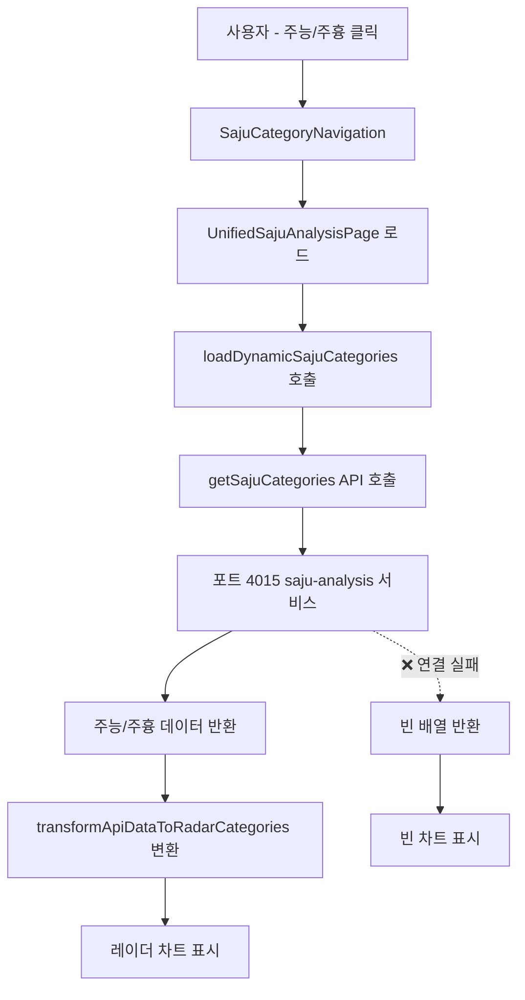

# 🔮 주능/주흉 레이더 차트 복원 작업지시서

## 📌 현재 문제
**"레이더 차트의 주능/주흉 카테고리가 표시되지 않음"** - 8번째, 9번째 카테고리인 주능(⚡)과 주흉(⚠️) 레이더 차트가 비어있음

## ✅ 사용자 확인 사항
- 주능/주흉은 **레이더 차트의 마지막 부분**에 있던 기능
- 이전에는 **정상적으로 표시되었음**
- 현재는 주능/주흉 버튼은 보이지만 **차트 내용이 비어있음**
- 사주 분석 백엔드 서비스와 연동 문제로 추정

## 🔍 문제 심층 분석

### 1️⃣ 레이더 차트 구조 확인

#### A. 카테고리 네비게이션 상태
```typescript
// sajuRadarData.ts에서 확인됨
- 1. 주본 ✅ 정상
- 2. 주성 ✅ 정상
- 3. 주정 ✅ 정상
- 4. 주습 ✅ 정상
- 5. 주취 ✅ 정상
- 6. 주업 ✅ 정상
- 7. 주학 ✅ 정상
- 8. 주능 ⚠️ 빈 배열 (subcategories: [])
- 9. 주흉 ⚠️ 빈 배열 (subcategories: [])
```

#### B. 백엔드 API 연동 상태
```typescript
// sajuAnalysisApi.ts 분석
- API 엔드포인트: http://localhost:4015/api/saju
- 주능/주흉 데이터 변환 로직: ✅ 구현됨
- fetchSajuCategories() 함수: ✅ 존재함
- transformApiDataToRadarCategories() 함수: ✅ 존재함
```

#### C. 백엔드 서비스 확인
```bash
packages/backend/services/
- calendar/ ✅ 실행 중 (포트 4012)
- saju-analysis/ ❓ 확인 필요 (포트 4015)
```

### 2️⃣ 근본 원인 분석

1. **사주 분석 서비스 미실행**: 포트 4015에서 saju-analysis 서비스가 실행되지 않음
2. **API 호출 실패**: getSajuCategories() 함수에서 백엔드 연결 실패
3. **동적 로딩 실패**: loadDynamicSajuCategories()에서 데이터 업데이트 안됨
4. **에러 핸들링**: API 실패 시 빈 배열로 fallback되어 차트가 비어짐

### 3️⃣ 데이터 플로우 확인



## 🎯 해결 방안

### Phase 1: 백엔드 서비스 복원 (20분)

#### 1. saju-analysis 서비스 확인 및 실행
```bash
# 1. 서비스 디렉토리 확인
cd packages/backend/services/saju-analysis

# 2. package.json 확인
cat package.json

# 3. 서비스 실행
PORT=4015 npm start
# 또는
PORT=4015 npx ts-node --transpile-only src/index.ts
```

#### 2. API 엔드포인트 테스트
```bash
# 주능/주흉 카테고리 API 테스트
curl http://localhost:4015/api/saju/categories

# 종합 점수 API 테스트 (POST)
curl -X POST http://localhost:4015/api/saju/scores/comprehensive \
  -H "Content-Type: application/json" \
  -d '{
    "user_id": "test",
    "birth_date": "1990-01-01",
    "birth_time": "12:00",
    "is_lunar": false
  }'
```

### Phase 2: API 연동 검증 (15분)

#### 1. 프론트엔드에서 API 호출 테스트
```typescript
// 브라우저 콘솔에서 테스트
import { getSajuCategories } from '@/services/sajuAnalysisApi';

getSajuCategories().then(categories => {
  console.log('주능/주흉 카테고리:', categories);
}).catch(error => {
  console.error('API 오류:', error);
});
```

#### 2. 동적 로딩 함수 확인
```typescript
// loadDynamicSajuCategories() 함수 디버깅
import { loadDynamicSajuCategories } from '@/data/sajuRadarData';

loadDynamicSajuCategories().then(() => {
  console.log('동적 카테고리 로드 완료');
}).catch(error => {
  console.error('동적 로딩 실패:', error);
});
```

### Phase 3: 에러 처리 개선 (10분)

#### 1. API 실패 시 Mock 데이터 제공
```typescript
// sajuRadarData.ts에 fallback 데이터 추가
const MOCK_JUNEUNG_DATA = {
  id: 'juneung',
  name: '주능',
  icon: '⚡',
  description: '능력과 잠재력 분석',
  subcategories: [
    {
      id: 'positive_abilities',
      name: '긍정적 능력',
      items: [
        { id: 'leadership', name: '리더십', baseScore: 75 },
        { id: 'creativity', name: '창의력', baseScore: 80 },
        { id: 'communication', name: '소통력', baseScore: 70 }
      ]
    }
  ]
};

const MOCK_JUHYUNG_DATA = {
  id: 'juhyung',
  name: '주흉',
  icon: '⚠️',
  description: '위험과 주의사항 분석',
  subcategories: [
    {
      id: 'risk_factors',
      name: '위험 요소',
      items: [
        { id: 'impulsiveness', name: '충동성', baseScore: 60 },
        { id: 'anxiety', name: '불안감', baseScore: 55 },
        { id: 'stubbornness', name: '고집', baseScore: 65 }
      ]
    }
  ]
};
```

### Phase 4: 사용자 경험 개선 (10분)

#### 1. 로딩 상태 표시 개선
```typescript
// UnifiedSajuAnalysisPageWithLifeChart.tsx
{isLoadingCategories && (
  <div className="mb-6 p-4 bg-blue-50 dark:bg-blue-900/20 border border-blue-200 dark:border-blue-700 rounded-lg">
    <div className="flex items-center space-x-3">
      <div className="animate-spin w-5 h-5 border-2 border-blue-600 border-t-transparent rounded-full" />
      <span className="text-blue-700 dark:text-blue-300 font-medium">
        🔮 주능/주흉 카테고리 데이터를 백엔드에서 가져오는 중...
      </span>
    </div>
  </div>
)}
```

#### 2. 에러 상태 표시 추가
```typescript
{categoryLoadError && (
  <div className="mb-6 p-4 bg-red-50 dark:bg-red-900/20 border border-red-200 dark:border-red-700 rounded-lg">
    <div className="flex items-center space-x-3">
      <span className="text-red-700 dark:text-red-300">
        ⚠️ 주능/주흉 데이터를 불러오는데 실패했습니다.
        사주 분석 서비스가 실행 중인지 확인해주세요.
      </span>
    </div>
  </div>
)}
```

## 🚀 단계별 실행 계획

### Step 1: 백엔드 서비스 상태 확인 (5분)
1. ⬜ saju-analysis 서비스 디렉토리 확인
2. ⬜ 포트 4015 사용 여부 확인
3. ⬜ 서비스 실행 상태 점검

### Step 2: saju-analysis 서비스 실행 (10분)
1. ⬜ package.json 및 의존성 확인
2. ⬜ PORT=4015로 서비스 시작
3. ⬜ 서비스 정상 실행 확인

### Step 3: API 연동 테스트 (10분)
1. ⬜ /api/saju/categories 엔드포인트 테스트
2. ⬜ 프론트엔드에서 API 호출 확인
3. ⬜ 주능/주흉 데이터 변환 확인

### Step 4: 레이더 차트 표시 확인 (10분)
1. ⬜ 브라우저에서 주능/주흉 카테고리 클릭
2. ⬜ 레이더 차트 정상 표시 확인
3. ⬜ 서브카테고리 및 항목 표시 확인

### Step 5: 에러 처리 및 UX 개선 (10분)
1. ⬜ API 실패 시 적절한 에러 메시지 표시
2. ⬜ 로딩 상태 개선
3. ⬜ Mock 데이터 fallback 추가 (필요시)

## 🎯 예상 결과

### Before (현재)
```
주능 카테고리: ⚡ 주능 [빈 차트]
주흉 카테고리: ⚠️ 주흉 [빈 차트]
로딩 메시지: "🔮 주능/주흉 카테고리 데이터를 백엔드에서 가져오는 중..."
```

### After (목표)
```
주능 카테고리: ⚡ 주능 [레이더 차트 표시]
  - 긍정적 능력, 리더십 특성, 창의적 사고 등
주흉 카테고리: ⚠️ 주흉 [레이더 차트 표시]
  - 위험 요소, 주의사항, 개선점 등
```

## ⚠️ 핵심 요구사항

1. **saju-analysis 서비스 실행**: 포트 4015에서 정상 작동
2. **API 연동 복원**: GET /api/saju/categories 정상 응답
3. **데이터 변환 확인**: positive/negative → 주능/주흉 변환
4. **레이더 차트 표시**: 카테고리 클릭 시 정상 차트 표시
5. **에러 처리**: API 실패 시 적절한 사용자 피드백

## 📊 성공 기준

- [ ] 포트 4015에서 saju-analysis 서비스 정상 실행
- [ ] 주능 카테고리 클릭 시 레이더 차트 표시
- [ ] 주흉 카테고리 클릭 시 레이더 차트 표시
- [ ] 서브카테고리 및 세부 항목 정상 표시
- [ ] API 오류 시 적절한 에러 메시지 표시

## 🔧 참고 정보

### 관련 파일
- `packages/backend/services/saju-analysis/` - 백엔드 서비스
- `packages/web/src/services/sajuAnalysisApi.ts` - API 연동
- `packages/web/src/data/sajuRadarData.ts` - 동적 로딩
- `packages/web/src/pages/UnifiedSajuAnalysisPageWithLifeChart.tsx` - UI 페이지

### API 스펙
- 엔드포인트: `http://localhost:4015/api/saju/categories`
- 메소드: GET
- 응답: `{ success, message, data: { positive, negative } }`

---
**작성일**: 2025-09-19
**작성자**: Claude Code Assistant
**상태**: 실행 대기 중
**우선순위**: 🔴 최고 (사용자 보고 기능 복원)
**변경사항**: 레이더 차트의 주능/주흉 카테고리 복원을 위한 새 작업지시서